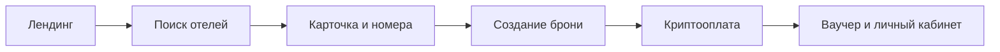

<div align="center">

# ✦ Aifory Stay

### Отели без границ. Путешествия без «не получится».

Современный адаптивный лендинг сервиса бронирования отелей по всему миру  
с возможностью оплаты криптовалютой.

[](https://quiet-orbit-7k9m.vercel.app/)
[](https://react.dev/)
[](https://www.typescriptlang.org/)
[](https://vite.dev/)

[Посмотреть сайт](https://quiet-orbit-7k9m.vercel.app/) · [План развития](./PROJECT_PLAN.md) · [Сообщить о проблеме](https://github.com/happycrew/travel_app/issues)

</div>

---

## О проекте

**Aifory Stay** — визуальная концепция travel-сервиса, который снимает платёжные ограничения при бронировании зарубежных отелей. Пользователь выбирает направление и номер, оплачивает заказ привычной криптовалютой и получает ваучер после подтверждения транзакции.

Лендинг объединяет эмоциональную travel-подачу, понятный поисковый сценарий и подготовленную событийную аналитику. Дизайн не копирует референсы: для проекта создана собственная редакционная композиция с крупной типографикой, плавающими карточками бронирования и мотивом маршрута.

## Что уже реализовано

- адаптивная вёрстка для desktop, tablet и mobile;
- выразительный hero-блок с интерактивной формой поиска;
- анимированные карточки, маршрутные элементы и marquee;
- подборка отелей и продуктовый сценарий «поиск → номер → оплата»;
- блок преимуществ, доверия, FAQ и финальный CTA;
- доступная семантическая разметка и управление с клавиатуры;
- поддержка `prefers-reduced-motion`;
- события для GTM/Data Layer, GA4 и Яндекс Метрики;
- production-сборка и публичный деплой на Vercel.

## Технологии

| Область | Решение |
|---|---|
| Интерфейс | React 19 + TypeScript 7 |
| Сборка | Vite 8 |
| Анимации | Motion for React |
| Иконки | Lucide React |
| Стили | Custom CSS, responsive grid, CSS variables |
| Аналитика | Data Layer, GA4, Яндекс Метрика |
| Хостинг | Vercel |

## Быстрый старт

Требуется Node.js 22.12+ и npm. Рекомендуемая версия закреплена в `.nvmrc`.

```bash
git clone git@github.com:happycrew/travel_app.git
cd travel_app
nvm use
npm install
npm run dev
```

Приложение будет доступно по адресу [http://127.0.0.1:4173](http://127.0.0.1:4173).

### Доступные команды

```bash
npm run dev       # локальная разработка
npm run build     # TypeScript-check и production-сборка
npm run preview   # просмотр production-сборки
```

## Структура проекта

```text
travel_app/
├── src/
│   ├── App.tsx          # секции лендинга и интерактивные сценарии
│   ├── analytics.ts     # единый слой событий аналитики
│   ├── main.tsx         # точка входа React
│   └── styles.css       # дизайн-система, анимации и адаптивность
├── PROJECT_PLAN.md      # план MVP, бэкенда и развития продукта
├── index.html           # метаданные и подключение шрифтов
├── package.json
└── vite.config.ts
```

## Аналитика

Все продуктовые события проходят через `src/analytics.ts` и отправляются в доступные интеграции:

```text
landing_view
hotel_search_submit
hotel_card_click
hotel_favorite
faq_open
scroll_depth
engaged_30_seconds
```

Для Яндекс Метрики перед запуском приложения необходимо задать идентификатор счётчика:

```ts
window.__AIFORY_YM_ID__ = 12345678;
```

В режиме разработки события дополнительно выводятся в консоль браузера.

## Следующие этапы



Подробный план включает интеграцию hotel inventory API, PostgreSQL, кеширование, идемпотентные заказы, webhooks оплаты, возвраты, админ-панель, observability и продуктовые эксперименты. Он находится в [`PROJECT_PLAN.md`](./PROJECT_PLAN.md).

## Качество

- production-сборка проходит без ошибок;
- зависимости проверены через `npm audit`;
- интерфейс протестирован на desktop и viewport `390 × 844`;
- в консоли браузера нет ошибок и предупреждений;
- целевые показатели: LCP ≤ 2,5 c, INP ≤ 200 мс, CLS ≤ 0,1.

---

<div align="center">
  Сделано для путешествий, которые начинаются с уверенного «да» ✈️
</div>
