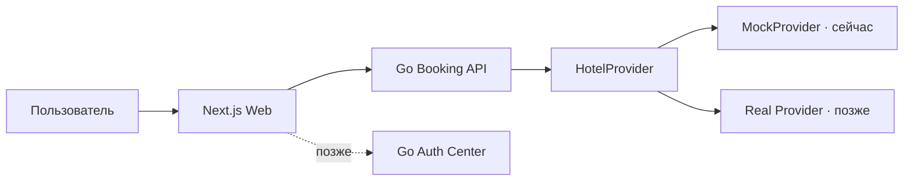

<div align="center">

# ✦ Aifory Stay

### Отели без границ. Путешествия без «не получится».

Full-stack прототип сервиса бронирования отелей по всему миру<br />
с provider-neutral API и будущей оплатой криптовалютой.

[](https://quiet-orbit-7k9m.vercel.app/)
[](https://nextjs.org/)
[](https://go.dev/)
[](./api/openapi.yaml)

[Лендинг](https://quiet-orbit-7k9m.vercel.app/) · [API-контракт](./api/openapi.yaml) · [План развития](./PROJECT_PLAN.md) · [Issues](https://github.com/happycrew/travel_app/issues)

</div>

---

## О проекте

**Aifory Stay** развивается из эмоционального travel-лендинга в полноценный сервис поиска и бронирования. Пользователь выбирает направление и даты, получает выдачу отелей, применяет сортировку и фильтры, сравнивает расположение и условия проживания.

Текущий backend работает через `MockProvider`: он детерминированно создаёт 2 000 отелей и реализует тот же контракт, который позже будет использовать адаптер реального hotel inventory provider. Благодаря этому frontend не придётся переписывать при подключении Expedia Rapid, Booking.com Demand API или другого поставщика.

> Публичный demo пока показывает landing-версию. Полная выдача запускается локально вместе с Go API.

## Реализовано

### Web

- Next.js App Router и React 19;
- адаптивный лендинг с анимациями и аналитикой;
- реальный переход формы на `/search` с URL-параметрами;
- выдача отелей и состояния loading/error/empty;
- сортировка по цене, рейтингу, расстоянию и рекомендациям;
- фильтры по цене, звёздам, завтраку и бесплатной отмене;
- desktop layout «фильтры → список → карта»;
- mobile layout для viewport `390 × 844`;
- карта-превью с ценовыми маркерами;
- события Data Layer, GA4 и Яндекс Метрики.

### Booking API

- Go 1.26 и стандартный `net/http`;
- provider-neutral интерфейс `HotelProvider`;
- каталог из 2 000 воспроизводимых mock-отелей;
- location suggestions;
- поиск по городу, стране и названию;
- даты, количество комнат и расчёт полной стоимости;
- фильтры, сортировка, facets и cursor pagination;
- карточка отеля по ID;
- CORS, ограничения размера request body и server timeouts;
- OpenAPI 3.1;
- unit и HTTP contract tests;
- Dockerfile и Docker Compose.

Auth пока намеренно не подключён: публичный поиск и просмотр отелей от него не зависят.

## Архитектура



## Быстрый старт

Необходимы:

- Node.js 22.12+ — рекомендуемая версия находится в `.nvmrc`;
- Go 1.26+ или Docker.

```bash
git clone git@github.com:happycrew/travel_app.git
cd travel_app
nvm use
npm install
```

Запустите backend в первом терминале:

```bash
npm run backend:dev
```

Запустите web во втором терминале:

```bash
npm run dev
```

- Web: [http://127.0.0.1:4173](http://127.0.0.1:4173)
- Booking API: [http://127.0.0.1:8080](http://127.0.0.1:8080)
- Health check: [http://127.0.0.1:8080/healthz](http://127.0.0.1:8080/healthz)

### Запуск backend через Docker

```bash
docker compose -f infra/compose.yaml up --build
```

### Проверки

```bash
npm run build          # production-сборка Next.js
npm run backend:test   # Go unit и HTTP tests
npm audit              # аудит frontend-зависимостей
```

## Структура

```text
travel_app/
├── api/
│   └── openapi.yaml
├── infra/
│   └── compose.yaml
├── services/
│   └── booking-api/
│       ├── cmd/api/
│       ├── internal/domain/
│       ├── internal/httpapi/
│       ├── internal/provider/mock/
│       ├── Dockerfile
│       └── go.mod
├── src/
│   ├── app/
│   │   ├── page.tsx
│   │   └── search/
│   ├── App.tsx
│   ├── analytics.ts
│   ├── lib/api.ts
│   └── styles.css
├── .env.example
├── next.config.ts
└── package.json
```

## API

Основные endpoints:

```http
GET  /healthz
GET  /v1/locations/suggest?q=стам
POST /v1/hotels/search
GET  /v1/hotels/{hotelID}
```

Пример поиска:

```bash
curl -X POST http://127.0.0.1:8080/v1/hotels/search \
  -H 'Content-Type: application/json' \
  -d '{
    "query": "Стамбул",
    "checkIn": "2026-08-14",
    "checkOut": "2026-08-21",
    "rooms": [{"adults": 2, "childrenAges": []}],
    "currency": "RUB",
    "sort": "price_asc",
    "filters": {"stars": [4, 5], "refundableOnly": true},
    "limit": 24
  }'
```

Полный контракт находится в [`api/openapi.yaml`](./api/openapi.yaml).

## Конфигурация

Скопируйте `.env.example` в `.env.local`, если адреса сервисов отличаются от стандартных:

```env
NEXT_PUBLIC_BOOKING_API_URL=http://127.0.0.1:8080
PORT=8080
WEB_ORIGIN=http://127.0.0.1:4173
MOCK_PROPERTY_COUNT=2000
```

## Следующие задачи

1. Autocomplete направлений на лендинге.
2. Настоящий MapLibre-слой и поиск по `bbox`.
3. Страница отеля и availability номеров.
4. PostgreSQL + PostGIS и Redis.
5. Mock checkout с идемпотентным созданием брони.
6. Интеграция Go auth-center.
7. Адаптер реального hotel inventory provider.

Подробная последовательность находится в [`PROJECT_PLAN.md`](./PROJECT_PLAN.md).

## Качество

- Next.js production build проходит успешно;
- Go tests проходят для provider и HTTP API;
- `npm audit`: 0 известных уязвимостей;
- проверены desktop и mobile `390 × 844`;
- в браузере нет runtime-ошибок;
- mock-данные воспроизводимы и подходят для автотестов.

---

<div align="center">
  Сделано для путешествий, которые начинаются с уверенного «да» ✈️
</div>
